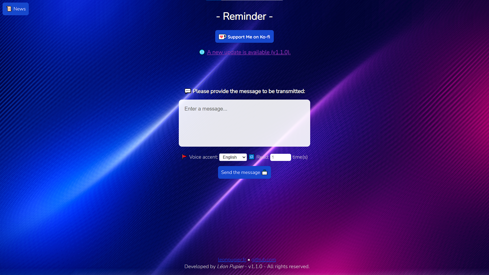
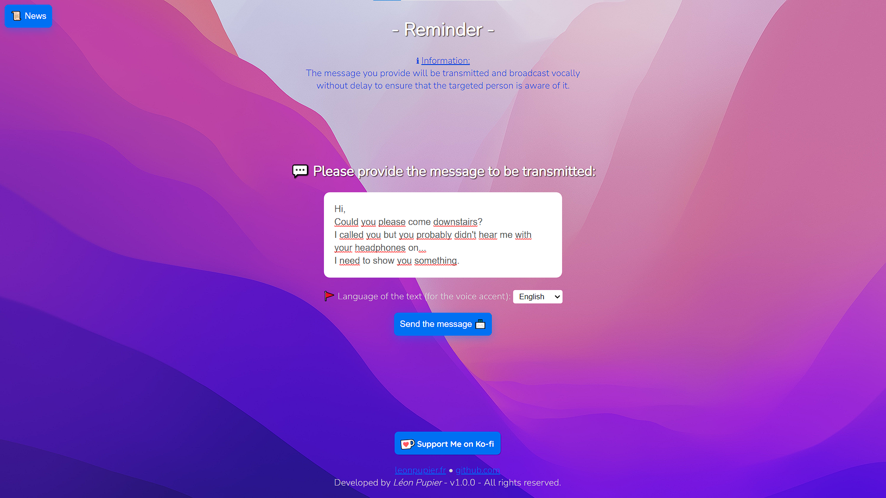
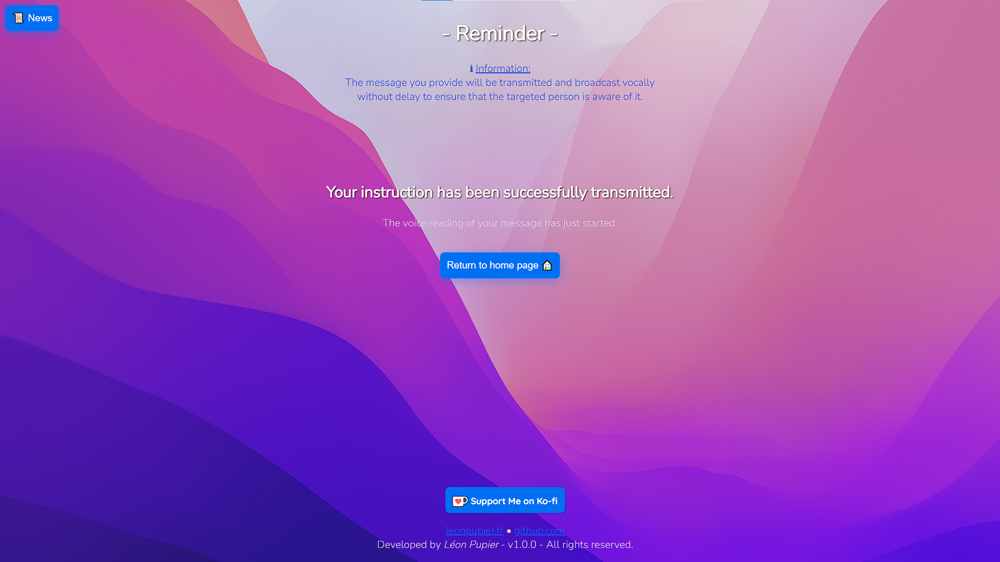
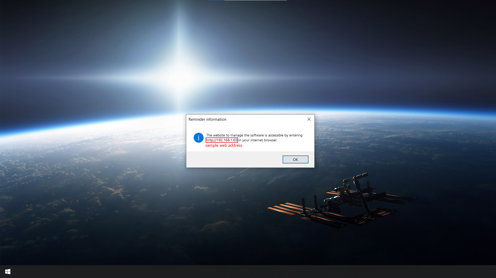

<!-- PROJECT LOGO -->
 

  

  <h3 align="center">♦ Reminder ♦</h3>

  

    A website allowing to broadcast by voice a written message on the recipient's computer to send him a message.
     
    <a href="https://www.leonpupier.fr/projects/reminder"><strong>See on the website »</strong></a>
     
     
    <a href="https://github.com/LeonPupier/Reminder/issues">Report Bug or request feature</a>
  

   
   

<!-- PROJECT SHIELDS -->
<!--  -->
<!--  -->

<!-- TABLE OF CONTENTS -->

  
<b>Table of Contents</b>

  <ol>
    <li><a href="#description">Description</a></li>
    <li><a href="#requirements">Requirements</a></li>
    <li><a href="#installation">Installation</a></li>
    <li><a href="#roadmap">Roadmap</a></li>
    <li><a href="#gallery">Gallery</a></li>
    <li><a href="#credits">Credits</a></li>
    <li><a href="#license">License</a></li>
    <li><a href="#contact">Contact</a></li>
  </ol>

<!-- CONTENTS -->
# Description
***Reminder*** is a completely **free software** financed only by [donations](https://ko-fi.com/leonpupier) from generous users.

This service allows you to launch on the computer of the desired person a small software very economical in resources that will give you access to a website.
You can send text messages via the website.

Once your message is sent, the computer will receive it and a robotic voice will read the message on the computer's current audio device so that your message can be heard by the recipient under any circumstances.

This allows for example to pass instructions between 2 people who are too far away in the house to communicate without moving.

Moreover, if the recipient is listening to music and that affects his perception of surrounding sounds like your voice, the fact that the robotic voice reads your message sent with the website guarantees that the recipient will have received your message even while listening to music at the same time.

The website is available on all platforms! You can access it from another computer, a tablet and even your smartphone! Nice not.

# Requirements
In order to use the software on your computer, it must meet several requirements:
- Operating system: Windows 10 / 11
- Processor architecture: *32 / 64 bits (recommended)*
- **Internet access required**

# Installation
To install ***Reminder*** on your computer under *Windows* you just have to download the following [installer](https://github.com/LeonPupier/Reminder/releases/latest) 
and follow the instructions of the executable named **Reminder_Setup.exe**.

*There is no need to restart the computer for the software to install perfectly.*

# Roadmap
- [x] Public release in 1.0.0

# Gallery

  
  
  
  

# Credits
The software was thought, coded and realized by *Léon Pupier*.

Some of the icons used were downloaded from [Flaticon](https://www.flaticon.com/).

The changes file is available at [this address](https://github.com/LeonPupier/Reminder/blob/main/changelog.txt).

# License
All rights reserved to *Léon Pupier*.

# Contact
**Contact me:**

**Email:** [leonpupier@gmail.com](mailto:leonpupier@gmail.com)

**Website:** [leonpupier.fr](https://leonpupier.fr)
